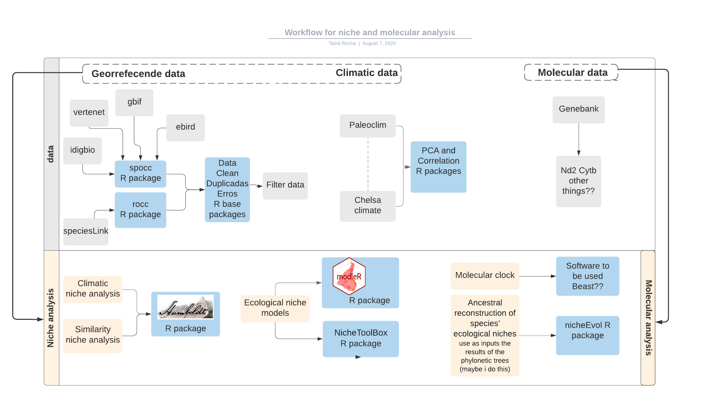

##############################################################################################
# Title: "Disjoint birds of Amazon and Atlantic forests"
# Author: "Tainá Rocha"
# This is a repository of niche and molecular analysis for disjoint Amazon and Atlantic forest birds.
##############################################################################################
# Ps.: In progress										

# Steps for niche analysis :

1. Compiled and cleaning occurrence data for species. Here we use 2 workflows for this step:

    - rocc (https://github.com/saramortara/rocc)
    
    - CoordinateCleaner (https://github.com/ropensci/CoordinateCleaner)
    
2. Climatic variables. We use two dataset of climatic variables.
 
      - Paleoclim: Describe beter why I choose this (in this case is about resolution the time periods available, the most complete and recent data)
      - Chelsa:  
    
3. Exploratory Analysis 

      - Extract environmental values values to point 
      - Build a principal component analysis (PCA)
      - Select the most important variables for species
      
4. Niche analysis 

      - Niche similarity using humbolds package (https://github.com/jasonleebrown/humboldt)
      
5. Ecological Niche models using two different approaches and two different workflows

      - modler package: using different algorithms to map niches suitability  (https://github.com/Model-R , https://github.com/Model-R/modleR).
      
      - ntbox package: using using ellipsoids to model niches suitability (https://github.com/luismurao/ntbox/)
      
 6. nicheEvol
      
# Steps for molecular analysis (Nicólas Ordax) 

1. Compiled sequences from genebank....

2. Phyloegetic tree... 
     
##############################################################################################

Gray boxs for datasources.

Yellow boxes for analysis.

Blue boxs for R packages and softwares to process the data.

