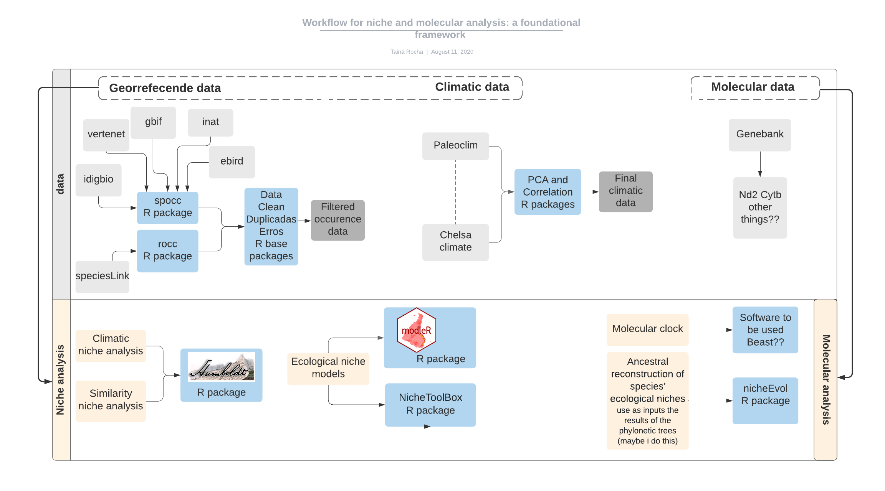

#######################################################################################################
### Title: Disjoint birds of Amazon and Atlantic forests, a biogeography perspective
### Author: Tainá Rocha
### This is a repository of niche and molecular analysis for disjoint Amazon and Atlantic forest birds
#### Ps.: In progress
#######################################################################################################

										
## Steps for niche analysis :

1. Compiled occurrence records for species. Here we use 2 workflows for this step:

    - [ ] rocc (https://github.com/saramortara/rocc)  
    - [ ] spocc (https://github.com/ropensci/spocc)
    
2. Clean occurence (R base funtions)  

    - [ ] Remove wrong records
    - [ ] Remove too old records
    - [ ] Remove duplicates  
    - [ ] Specialist check
    
3. Climatic variables. We use two dataset of climatic variables.
 
    - [ ] Paleoclim: http://www.paleoclim.org/ (The most complete and recent data with better resolution)
    - [ ] Chelsa: https://chelsa-climate.org/ 
    
4. Exploratory Analysis 

    - [ ]  Extract environmental values values to point 
    - [ ]  Build a principal component analysis (PCA)
    - [ ]  Select the most important variables for species
      
5. Niche analysis 

    - [ ]  Niche similarity using humbolds package (https://github.com/jasonleebrown/humboldt)
      
6. Ecological Niche models using two different approaches and two different workflows

    - [ ] modler package: using different algorithms to map niches suitability  (https://github.com/Model-R , https://github.com/Model-R/modleR).      
    - [ ] ntbox package: using using ellipsoids to model niches suitability (https://github.com/luismurao/ntbox/)
      
 7. nicheEvol
 
    - [ ] study this package (https://github.com/hannahlowens/nichevol)
      
## Steps for molecular analysis  @nicoordax

1. Compiled sequences from genebank....

    - [ ] *Lipaugus vociferans*
    - [ ] *Schiffornis tudina*
    - [ ] *Xiphorhynchus guttatus*
    - [ ] *Xiphorhynchus guttatoides* 
     

2. Phyloegetic tree... 

    - [ ] ML and Baeysian Trees (?)
    - [ ] Molecular date (?)
    
    
     
##############################################################################################

###### Light gray boxs for datasources
###### Gray box for filtered data
###### Blue boxs for R packages and softwares to process the data
###### Yellow boxes for analysis

